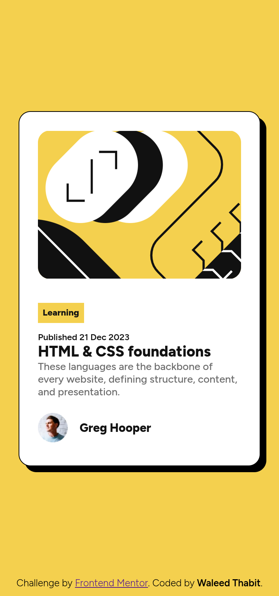
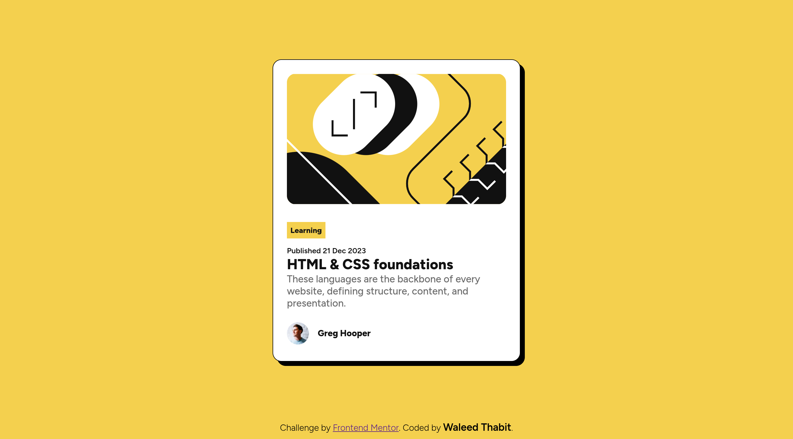
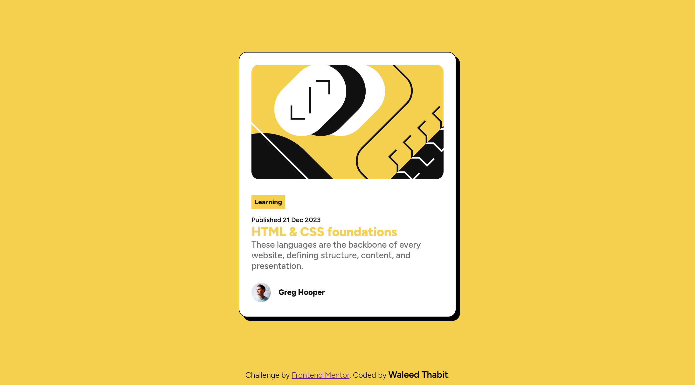

## Frontend Mentor - Blog preview card solution

This is a solution to the [Blog preview card challenge on Frontend Mentor](https://www.frontendmentor.io/challenges/blog-preview-card-ckPaj01IcS). Frontend Mentor challenges help you improve your coding skills by building realistic projects.

## Table of contents

- [Overview](#overview)
  - [The challenge](#the-challenge)
  - [Screenshot](#screenshot)
  - [Links](#links)
- [My process](#my-process)
  - [Built with](#built-with)
  - [What I learned](#what-i-learned)
  - [Continued development](#continued-development)
  - [AI Collaboration](#ai-collaboration)
- [Author](#author)

## Overview

### The challenge

Users should be able to:

- See hover and focus states for all interactive elements on the page

### Screenshot

Mobile:



Desktop:



Focus/hover state on the title:



### Links

- Solution URL: [https://github.com/waleed-thabit/blog-preview-card](https://github.com/waleed-thabit/blog-preview-card)
- Live Site URL: [https://waleed-thabit.github.io/blog-preview-card/](https://waleed-thabit.github.io/blog-preview-card/)

## My process

### Built with

- Semantic HTML5 markup
- CSS custom properties
- Flexbox
- CSS Grid
- Mobile-first workflow
- Vanilla HTML and CSS only, no frameworks

### What I learned

This project was simple, but I learned more from it than from some bigger ones, mostly about spacing, sizing and centering.

- **`clamp()` for responsive font sizes.** I didn't know this function before this project. It lets a font size scale smoothly between a minimum and a maximum value, based on the viewport, without writing a media query just for text size.

```css
--res-fs-300: 20px, 5.2vw, 26px;
...
.title {
  font-size: clamp(var(--res-fs-300));
}
```

- **`aspect-ratio` with `object-fit` to crop the article image**, so it keeps a fixed ratio and fills its box cleanly on mobile, and returns to its natural size on larger screens.

```css
.img-1 {
  aspect-ratio: 5.5 / 4;
  object-fit: cover;
  object-position: center;
  width: 100%;
}
```

- **Centering and spacing without margin/padding hacks.** I focused on doing this properly with Flexbox and Grid instead.
- **Using variables for everything**, not just colors but spacing, border-radius and font sizes too, and moving away from `px` toward `rem` wherever possible.

### Continued development

- Keep practicing `clamp()` until it becomes second nature.
- Pay more attention to accessible focus states. I used `outline: none` on the interactive elements and relied only on color and underline changes to show focus, which is a common pattern but makes the focus state less visible for keyboard users. I want to fix this by keeping a visible `outline` (or using `:focus-visible`) alongside the other changes.

### AI Collaboration

I did not use AI to build this project. I used **Claude** to help me write this README, and it pointed out the `outline: none` issue on the focus states above, which I plan to fix in future projects.

## Author

- GitHub - [@waleed-thabit](https://github.com/waleed-thabit)
- Frontend Mentor - [@waleed-thabit](https://www.frontendmentor.io/profile/waleed-thabit) Blog preview card
